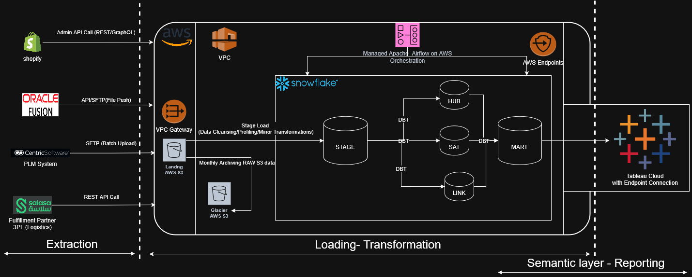

# 🧱 dbt Data Vault 2.0 — eCommerce Analytics Project

## 🧭 Overview

This project demonstrates how to implement a **Data Vault 2.0 architecture** using `dbt` to model data from multiple sources in the eCommerce and logistics domain.

It integrates data from:
- 🛒 **Shopify** (sales, products, customers)
- 🚚 **3PL Logistics (SALSA)** (Fulfillments, tracking, Delivery)
- 🏢 **Centic Software** (Planning, Inventory)
- 💰 **Finance/Accounting systems** (Oracle Fusion ERP)

The models are deployed and orchestrated using `ApacheAirflow- Managed in AWS` and tested in `Snowflake`.

---

## 🧱 Architecture

- **Staging Layer**: Standardized, cleaned data from each source
- **Hubs**: Business keys (e.g., customer, order, product)
- **Links**: Relationships (e.g., order ↔ products)
- **Satellites**: Contextual details (e.g., order status, address, payment)
- **Marts**: Flattened, analytics-ready views, materialized views

---

## 🧰 Tech Stack

| Component     | Tool/Service                 |
|---------------|------------------------------|
| Modeling      | `dbt` (Core + Cloud)         |
| Warehouse     | `Snowflake`                  |
| Orchestration | `ApacheAirflow - AWS Managed`|
| Ingestion     | `Python Custom`              |
| Versioning    | `GitHub`                     |
| Testing       | `dbt tests`, `snapshots`     |

---

## 🚀 How to Run
````bash
### 1. Clone the repo

git clone https://github.com/motiramgh/DBT-ECOMM-DATA-VAULT.git
cd DBT-ECOMM-DATA-VAULT

### 2. Update ~/.dbt/profiles.yml:
ecomm_data_vault:
  target: dev
  outputs:
    dev:
      type: snowflake
      account: <your_account>
      user: <your_username>
      password: <your_password>
      role: <your_role>
      database: <your_database>
      warehouse: <your_warehouse>
      schema: <your_schema>
      threads: 4
      client_session_keep_alive: false

### 3. Install dbt and Dependencies & Project Packages
pip install dbt-snowflake
dbt deps

### 4. To populate static reference data:
dbt seed

### 5. Run Staging Models
dbt run --select stage

### 6. Run Vault Models
dbt run --select vault
### Or run a specific component:
dbt run --select +hub_order

### 7. Run Data Marts (Optional)
##If you've defined any marts or reporting layers:
dbt run --select marts

### 8. Run All Models (Full Pipeline)
dbt run

### 9. Run Tests
dbt test

### 10. Generate and View Documentation
dbt docs generate
dbt docs serve